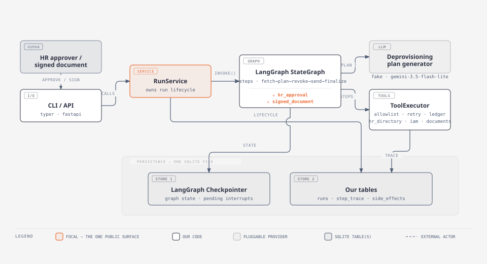

# Employee Offboarding Agent — Durable Orchestration Layer

An agent that offboards a departing employee: fetches their HR record,
generates a deprovisioning checklist with an LLM, pauses for HR approval,
revokes access, sends exit paperwork, pauses for the signed document to come
back, and archives the completed record. Built to survive the process being
killed at any point and resumed later without repeating a side effect.

```
fetch_employee → plan_deprovisioning → ⏸ await_hr_approval → revoke_access
  → send_exit_paperwork → ⏸ await_signed_document → finalize
```

Two interrupts, two side-effecting steps gated behind them, one high-risk
action (`revoke_access`) that never runs without a human having approved it
first.



---

## Quickstart

Requires Python ≥ 3.11.

```bash
python3 -m venv .venv && source .venv/bin/activate
pip install -e ".[dev]"
cp .env.example .env          # defaults work as-is; no API key needed
pytest -q                     # 94 tests, offline, no network
```

Run a full lifecycle:

```bash
offboarding start emp-001                                    # -> paused, hr_approval
offboarding approve <run_id> --approver priya.raman           # -> paused, signed_document
offboarding sign <run_id> --document-id doc_123                # -> completed
offboarding trace <run_id>                                     # full step-level trace
offboarding side-effects <run_id>                               # the idempotency ledger
```

Or over HTTP:

```bash
uvicorn offboarding.api.main:app --reload
# POST /runs {"employee_id": "emp-001"}  ->  POST /runs/{id}/approve  ->  POST /runs/{id}/sign
```

Three employees ship in the mocked HR directory: `emp-001`, `emp-002`, `emp-003`
(see [`offboarding/tools/hr_directory.py`](offboarding/tools/hr_directory.py)).

A full annotated transcript — including a genuine `kill -9` of a running
server mid-run and resuming it on a different process, and the
retry-on-failure path — is in
[`docs/demo-transcript.txt`](docs/demo-transcript.txt), generated by the
runnable [`scripts/demo.sh`](scripts/demo.sh):

```bash
scripts/demo.sh                          # watch it happen
scripts/demo.sh > docs/demo-transcript.txt  # regenerate the transcript
```

Nothing in it is simulated: every PID printed is real (each CLI call runs as
its own background process and is waited on), and the "process is dead"
check is a real failed connection after a real `kill -9`, not a comment
saying so.

### Using a real LLM

The checklist step defaults to a deterministic fake (`FakeLLM`) so the app and
every test run free and offline. To use Gemini instead:

```bash
pip install -e ".[gemini]"
# in .env: OFFBOARDING_LLM_PROVIDER=gemini, GEMINI_API_KEY=...
```

Uses `gemini-3.5-flash-lite` (the current lowest-cost model — this is one
lightweight structured-output call) via the `google-genai` SDK's Interactions
API, with `store=False` since the prompt carries employee PII and the call
never needs multi-turn continuation. See
[`offboarding/llm/gemini.py`](offboarding/llm/gemini.py).

---

## The use case

Employee offboarding, chosen because it naturally has everything the brief
asks for without forcing it: a real read tool (the HR record), an LLM step
whose output has to be trusted or rejected, exactly one action that's
genuinely dangerous (revoking access) sitting behind a human gate, a second
side effect with no approval requirement (sending paperwork), and a pause
that isn't about a human decision at all — waiting for a signed document to
come back from the outside world. That gives two structurally different
pause reasons for free, rather than two copies of the same one.

---

## Architecture

**LangGraph does two things here: durable execution, and `interrupt()` /
`Command(resume=...)`. Nothing else.** Not the state model, not the
lifecycle, not retries, not idempotency. Those live in this repo's own code,
in `domain/`, `persistence/`, and `tools/` — because they're what an operator
has to reason about at 2am, and because (see below) LangGraph's checkpointer
structurally cannot answer the one question that matters most: *did that side
effect actually happen?*

```
offboarding/
  domain/          RunStatus/StepStatus state machine, error taxonomy, read models
  persistence/      SQLite schema + three repositories (runs, trace, side_effects)
  tools/             registry, allowlist, the three tools, the idempotency ledger, retry executor
  llm/                LLMProvider protocol: FakeLLM (default) and GeminiLLM
  orchestration/    graph.py (LangGraph wiring), nodes.py (the 7 steps), run_service.py (public surface)
  api/                FastAPI over RunService
  cli/                Typer CLI over RunService
```

`RunService` ([`orchestration/run_service.py`](offboarding/orchestration/run_service.py))
is the only thing the CLI and API call. Neither has any logic of its own —
they format `RunService`'s output and map its exceptions to exit codes / HTTP
status codes. That's what makes "add a client" or "change the graph" a
one-file change rather than a rewrite.

### Two databases, one file — the central decision

```
offboarding.db
├── LangGraph's own tables (SqliteSaver)   — WHERE execution is
│     graph state, pending interrupts, resume position
└── our own tables                          — WHAT the business thinks happened
      runs          lifecycle: status, pause/failure reason, bounded-execution counters
      step_trace     append-only, one row per step attempt
      side_effects   the idempotency ledger
```

I verified this split is load-bearing, not decorative, before committing to
it: I killed a running graph mid-side-effect (`IamTool` applies the
revocation, then raises before its node returns) and inspected what
LangGraph's own checkpoint knew afterward. Ground truth said the revocation
had happened; the checkpoint said the step had never run —
`graph.get_state(cfg).next == ('revoke_access',)`. Checkpoints are written at
super-step boundaries from what a node *returns*; a node that dies before
returning leaves no trace there by construction, no matter how careful the
checkpointer implementation is. Resuming from that checkpoint alone would
revoke access a second time.

The `side_effects` ledger is the piece that survives that gap: its row is
written and committed **before** the tool is called (write-ahead), so recovery
can always tell "never attempted" from "possibly applied" and ask the
provider which one it was, instead of guessing. See
[`tools/ledger.py`](offboarding/tools/ledger.py) for the full state machine
(`reserved → in_progress → completed | failed`) and the reasoning behind each
transition.

The two stores share one physical file (so one artifact is the whole durable
state of the system) but use **separate SQLite connections** — LangGraph's
`SqliteSaver` holds a transaction open across node execution, and SQLite does
not nest transactions, so sharing a connection broke our own explicit `BEGIN
IMMEDIATE` blocks the first time I wired this together. Our connection runs
in autocommit mode; the only transactions on it are ones we open ourselves.

### Guardrails

- **Allowlist**: every step declares the exact tool names it may call
  (`orchestration/nodes.py::ALLOWLISTS`). `ToolExecutor` refuses anything
  outside that set — enforced at the call site, not left to a prompt. Both
  pause gates and the planning step hold *zero* tools, so a bug in the LLM
  step cannot revoke anything.
- **Approval gate ahead of the risk**: `revoke_access` is the one
  `requires_approval=True` tool, and it sits structurally after
  `await_hr_approval` in the graph — not just documented as risky.
- **Bounded execution**: every run carries `max_steps` and `max_tool_calls`
  (defaults 20 / 30). A `guard()` check runs before every node, and the tool
  executor checks the call budget before every attempt — including retries,
  so a stuck retry loop can't spend an unbounded number of calls.

### Failure handling

Every error is either `TransientToolError` (retry) or `PermanentToolError`
(don't) — see [`domain/errors.py`](offboarding/domain/errors.py). Retries run
through [`tenacity`](https://github.com/jd/tenacity)'s `Retrying`, driven one
attempt at a time by [`tools/executor.py`](offboarding/tools/executor.py)
rather than LangGraph's own `RetryPolicy` — that policy retries invisibly
around a whole node, and the brief requires retry information in the trace.
Driving it ourselves means every attempt, including the failed ones, gets its
own `step_trace` row with the error class and whether it was retryable.

### Traceability

`step_trace` is append-only: a retry or a resume adds a new attempt row
rather than overwriting the last one, so the full history — including
failures that were later retried successfully — stays visible. Every
tool-call result written to the trace passes through
[`domain/redaction.py`](offboarding/domain/redaction.py) first, which masks
any field whose key looks like a credential (`token`, `password`,
`api_key`, ...) recursively, by default, rather than trusting each call site
to remember.

---

## State model

**Run** (`RunStatus`): `pending → running → {paused ↔ running} → {completed |
failed | cancelled}`. Every transition is validated against an explicit table
in [`domain/run.py`](offboarding/domain/run.py) —
`ALLOWED_RUN_TRANSITIONS` — and an illegal move raises rather than silently
corrupting state. `RunRepository.set_status` applies this inside a `BEGIN
IMMEDIATE` transaction, so a concurrent approve and cancel can't interleave
into an impossible state.

**Step** (`StepStatus`): `pending → running → {completed | failed | paused}`,
with `failed → running` (retry) and, notably, `completed → running` legal.
That last one looks wrong at first — it isn't: LangGraph re-runs a node from
the top on every resume, so a step that completed a side effect before
pausing genuinely re-enters. (I actually had this backwards in an earlier
pass — forbade `completed → running` and called it "duplicate-effect
protection." It isn't; it broke legitimate resumes. Duplicate protection is
the ledger's job alone, via `side_effects.idempotency_key`'s `PRIMARY KEY`
constraint — a database guarantee, not an application check that could race.)

**PauseReason**: `hr_approval` | `signed_document`. **FailureReason**:
`tool_failed` | `approval_rejected` | `budget_exceeded` | `tool_not_allowed` |
`invalid_plan` | `needs_reconciliation` — the last one is the fail-closed
outcome when a crashed side effect can't be reconciled against its provider.

Adding a third pause reason is one enum member plus one node — the
orchestrator (`RunService._advance`) reads the reason out of whatever payload
the pausing node built; it has no list of reasons to extend.

---

## Idempotency and duplicate-request protection

Two independent layers, deliberately different from each other:

1. **Before the graph is even touched**: `RunService.approve()` /
   `submit_signed_document()` check the run is actually `PAUSED` for that
   specific reason first (`_require_paused_for`). A second identical request
   — the literal "duplicate resume request" scenario — is refused with
   `InvalidRunOperation` before a second `Command(resume=...)` ever reaches
   LangGraph.
2. **Inside the graph, at the tool boundary**: every side-effecting call goes
   through `SideEffectLedger.run_once()`, keyed on
   `{run_id}:{step_name}:{operation}` — deliberately excluding the attempt
   number, so attempt 1 and attempt 4 of the same logical effect collide on
   the same key and the ledger replays the cached result instead of calling
   the tool again.

Verified both empirically, not just by reading the code: `tests/test_tools.py::TestCrashRecovery`
and `tests/test_run_service.py::TestRestartRecovery` construct the tool
directly with `crash_after_apply=True` (records the effect with the mocked
provider, then raises `SimulatedProcessDeath` — a `BaseException`, so the
retry executor can't swallow it, matching what a real `SIGKILL` would do),
close every connection, build an entirely independent `RunService` from
nothing but the database file, and assert the provider only ever recorded the
effect once.

---

## Interface

**CLI** (`offboarding --help`): `start`, `show`, `list`, `approve`, `reject`,
`sign`, `resume`, `cancel`, `trace`, `side-effects`.

**API** (`uvicorn offboarding.api.main:app`): `POST /runs`, `GET /runs`,
`GET /runs/{id}`, `POST /runs/{id}/approve`, `POST /runs/{id}/reject`,
`POST /runs/{id}/sign`, `POST /runs/{id}/resume`, `POST /runs/{id}/cancel`,
`GET /runs/{id}/trace`, `GET /runs/{id}/side-effects`. `RunNotFound → 404`,
`InvalidRunOperation → 409`. Interactive docs at `/docs` once running.

`resume` / `POST .../resume` is worth calling out: it's *not* what
`approve`/`sign` do. Those feed a value into a **pending** `interrupt()` via
`Command(resume=...)`. A run that crashed mid-step (the stretch scenario) has
no pending interrupt — nothing to feed a value into — so it needs
`graph.invoke(None, config)` instead, LangGraph's mechanism for "just
continue from the last checkpoint." Writing the restart test surfaced that
this was missing entirely; see `RunService.resume_run`.

---

## Testing

```bash
pytest -q               # 94 tests, ~6s, fully offline
```

| File | Covers |
|---|---|
| `test_state_machine.py` | The transition tables in isolation |
| `test_repositories.py` | Persistence, trace shape, ledger uniqueness, reload-from-disk |
| `test_tools.py` | Allowlist, retries, budget, redaction, **crash-mid-call reconciliation** |
| `test_graph.py` | The compiled graph: both pauses, rejection, cancellation, retries |
| `test_gemini_provider.py` | Gemini provider logic with only the SDK boundary mocked |
| `test_run_service.py` | Full lifecycle, duplicate-request refusal, **two restart-recovery tests** |

The two tests that matter most against this brief are in
`TestRestartRecovery` (`test_run_service.py`): every service instance in them
is built fresh from a `db_path` and never reused across the simulated
"process boundary" — a passing run is evidence the durability claim holds,
not just that in-memory objects remembered what happened.

---

## Known trade-offs

- **SQLite, single-writer.** Fine for this assignment ("we care about the
  state model and recovery behavior more than database complexity," per the
  brief); a multi-user production deployment would move to Postgres for both
  stores — LangGraph ships a `PostgresSaver` as a near drop-in swap for
  `SqliteSaver`.
- **The API server is single-process.** `RunService` is built once at
  startup and reused; correct as written, but a second server process
  behind a load balancer would each build their own `RunService` against the
  same file, no synchronization between them beyond what SQLite itself
  provides. `BEGIN IMMEDIATE` prevents the state machine from being
  corrupted; it does not turn this into a distributed system.
- **`resume_run` requires a human (or a supervisor) to notice a run is
  stuck.** Nothing polls for runs stuck `RUNNING` and calls it automatically.
  In production this would be a periodic sweep with a staleness threshold.
- **The reconciliation path is fail-closed but not fail-forward.** A run that
  hits `needs_reconciliation` stops and waits for a human; there's no
  automatic "keep asking the provider until it answers" loop. Given the
  alternative is risking a duplicate side effect, I'd defend this as the
  right default rather than a gap — but it's a real operational cost.
- **One LLM call, no streaming, no tool-calling loop.** The plan-generation
  step is a single structured-output request. A more capable agent (multi-turn
  planning, the LLM choosing which systems need extra scrutiny) is a
  legitimate next step but wasn't needed to demonstrate the orchestration
  behavior this assignment is actually about.
